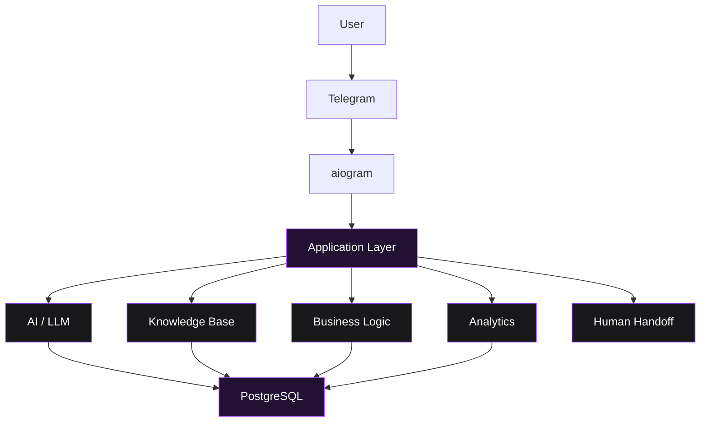
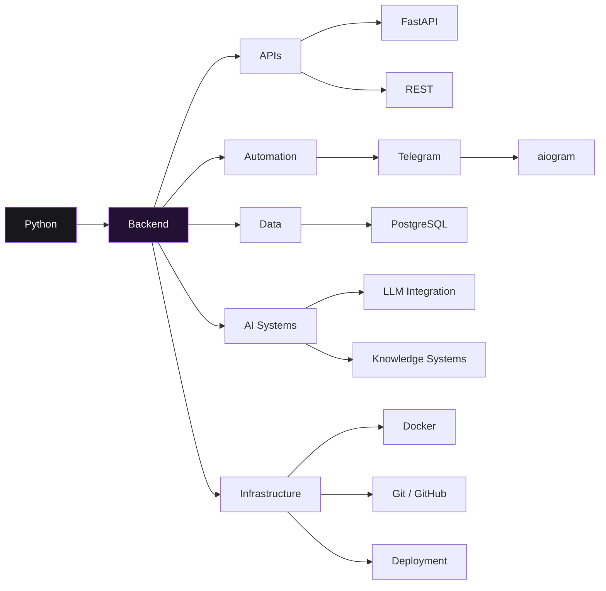

<!-- ===================================================== -->
<!--                       HEADER                          -->
<!-- ===================================================== -->

<div align="center">

<br>

# Ivan Mikhailyuk

<samp>Python Backend Developer</samp>

<br><br>


<br>

<samp>
backend systems&nbsp;&nbsp;•&nbsp;&nbsp;automation&nbsp;&nbsp;•&nbsp;&nbsp;AI integrations
</samp>

<br><br>


<br><br>

</div>

---

## 01 / ABOUT

```console
$ whoami
Ivan Mikhailyuk

$ role
Python Backend Developer

$ focus
Backend Systems
API Development
Telegram Automation
AI Integrations
Databases

$ location
Almaty, Kazakhstan

$ philosophy
Build software for real use.
```

I build backend systems, automation tools and AI-powered applications with a focus on practical use, maintainable architecture and real-world deployment.

My main direction is **Python backend development** — APIs, Telegram systems, databases, automation and AI integrations.

---

## 02 / STACK

<div align="center">


<br><br>

`Python` • `FastAPI` • `PostgreSQL` • `aiogram` • `REST API` • `Git` • `Docker`

</div>

---

## 03 / FEATURED WORK

### AI Telegram Assistant

A production-oriented Telegram system designed to automate customer communication and AI-assisted business workflows.



**Core stack**

`Python` `aiogram` `FastAPI` `PostgreSQL` `LLM`

**Key areas**

- persistent conversation history
- AI-powered responses
- structured knowledge
- source and campaign attribution
- analytics and event tracking
- human handoff
- reliable message processing
- production-oriented backend architecture

<details>
<summary><b>Architecture focus</b></summary>

<br>

The project is built around separation of concerns between Telegram transport, application logic, persistence, AI orchestration and analytics.

The goal is to keep the system maintainable while making it possible to extend individual components independently.

</details>

<br>

### Developer Portfolio

Personal developer space for projects, experiments and engineering work.

`Web` `UI` `GitHub` `Deployment`

---

## 04 / DEVELOPMENT MAP



---

## 05 / ENGINEERING APPROACH

```python
def build_product(idea):
    requirements = understand(idea)
    architecture = design(requirements)

    product = build(
        architecture=architecture,
        maintainable=True,
        observable=True
    )

    test(product)
    deploy(product)

    return iterate(product)
```

I prefer building around an actual problem rather than adding features just to increase the amount of code.

```text
problem
   │
   ▼
requirements
   │
   ▼
architecture
   │
   ▼
implementation
   │
   ▼
deployment
   │
   ▼
real usage
   │
   ▼
iteration
```

---

## 06 / GITHUB ACTIVITY

<div align="center">


<br><br>


</div>

---

## 07 / CURRENT DIRECTION

```text
Backend Engineering
        │
        ├── APIs
        ├── Databases
        ├── Automation
        ├── AI Integration
        └── Infrastructure
                │
                ▼
        Real-world systems
```

<samp>
Current priority: building software that survives outside localhost.
</samp>

---

<!-- ===================================================== -->
<!--                       FOOTER                          -->
<!-- ===================================================== -->

<div align="center">

<br>

<samp>
> design → build → ship → iterate
</samp>

<br><br>

```text
        /\_/\
       ( o.o )
        > ^ <
```

<samp>
code reviewed by management ↑
</samp>

<br><br>


<br>

<samp>
unsgndx · Python Backend Development
</samp>

<br><br>

</div>
